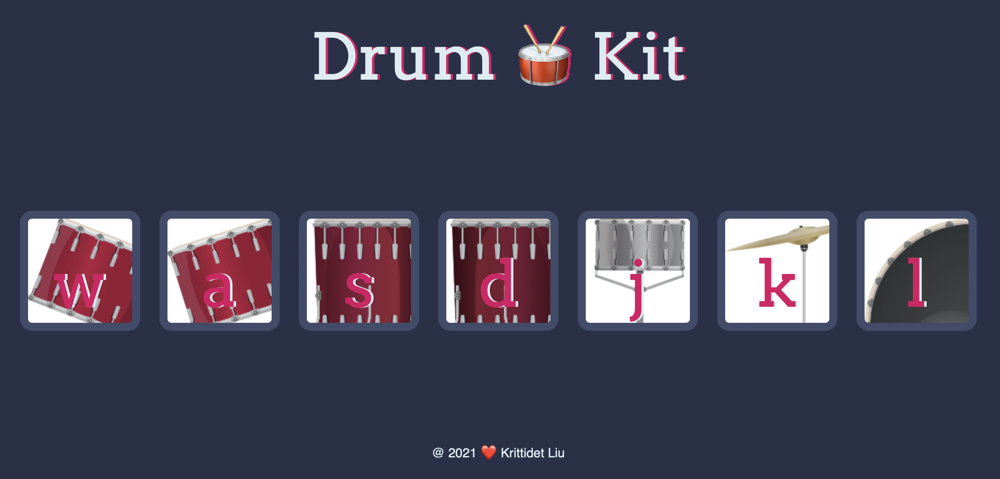

# DrumKit
 
Small front-end web development project from Udemy course (2022 Web Development Bootcamp by Dr. Angela Yu).

This project aimed at applying HTML, CSS, and JavaScript to create a drum audio website. Applied concepts including DOM query and eventListener in handling events such as click event and keydown event. 

**Sample**

 

